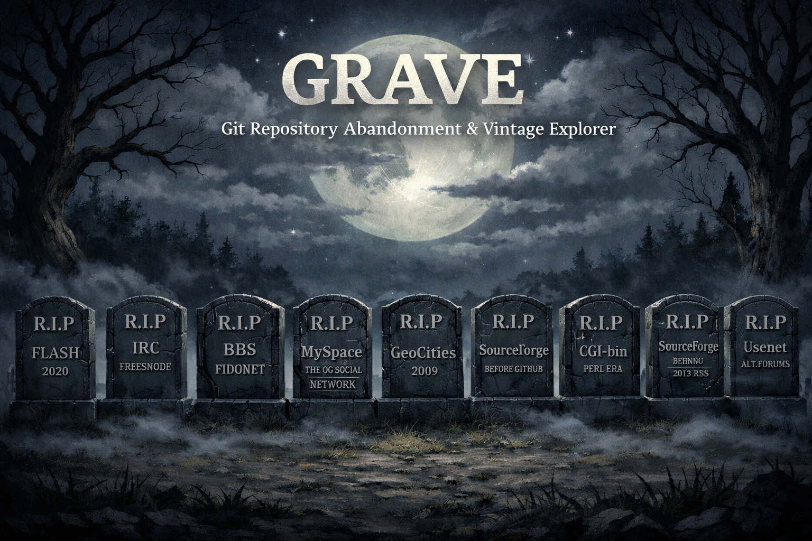
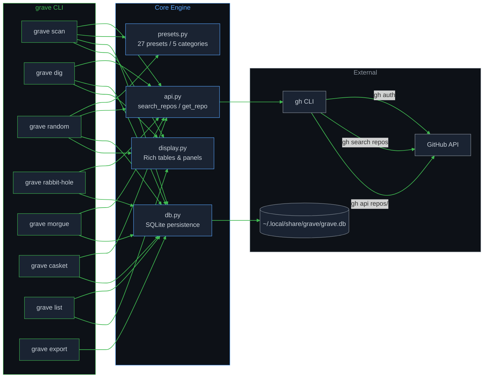
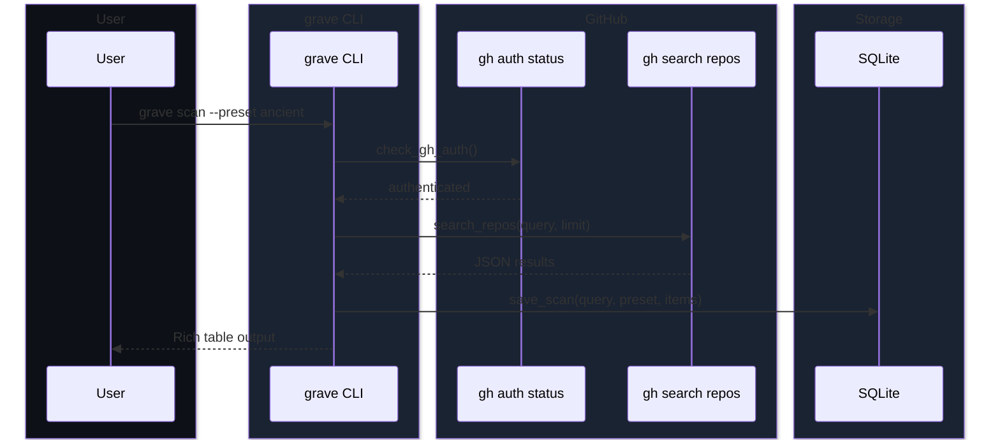

<p align="center">
  
</p>

<h1 align="center">GRAVE</h1>
<h3 align="center">Git Repository Abandonment & Vintage Explorer</h3>

<p align="center">
  <em>Dig up dead, forgotten, and vintage GitHub repositories.</em>
</p>

<p align="center">
  
  
  
  
  
  
  
  
</p>

---

**GRAVE** is a command-line tool for digital archaeology. It searches GitHub for old, weird, abandoned, and forgotten repositories using curated preset profiles and custom queries. Every result is persisted locally in SQLite so you can build your own collection of internet history.

## Features

- **27 curated presets** across 5 categories (archaeology, dead languages, eras, culture, science)
- **Era-based search** with named time windows (Y2K, dotcom bubble, Web 2.0, early GitHub)
- **Smart abandonment filters** (`--abandoned`, `--dead-since`)
- **Discovery commands** like `grave random` (slot machine) and `grave rabbit-hole` (find similar repos)
- **Thematic exploration** with `grave morgue` (dead forks) and `grave casket` (archived repos)
- **SQLite persistence** with automatic deduplication and scan history
- **Rich terminal UI** with clickable hyperlinks, colored tables, and formatted panels
- **Export** to JSON, CSV, or NDJSON
- **Zero token management** — delegates all auth to `gh` CLI

## Quick Start

```bash
# Clone and install
git clone https://github.com/YOUR_USER/grave.git
cd grave
uv sync

# First-time setup (checks prerequisites)
uv run grave init

# Start digging
uv run grave scan --preset ancient
uv run grave random
uv run grave dig torvalds/linux --open
```

## Requirements

| Dependency | Purpose |
|---|---|
| [Python 3.10+](https://python.org) | Runtime |
| [uv](https://docs.astral.sh/uv/) | Package manager |
| [gh CLI](https://cli.github.com) | GitHub API access (handles all authentication) |

## Installation

```bash
git clone https://github.com/YOUR_USER/grave.git
cd grave
uv sync
uv run grave init
```

`grave init` will verify your Python version, check that `gh` is installed, and walk you through GitHub authentication if needed.

## Architecture





## Commands

### Core Commands

| Command | Description |
|---|---|
| `grave init` | First-time setup and prerequisite checks |
| `grave scan` | Search for repos with presets or custom parameters |
| `grave dig <owner/repo>` | Deep-dive into a specific repository |
| `grave presets` | List all 27 available search presets |

### Discovery Commands

| Command | Description |
|---|---|
| `grave random` | Random preset slot machine — surprise yourself |
| `grave rabbit-hole <owner/repo>` | Find similar repos by language, era, and topics |
| `grave morgue` | Search for dead forks and repos with inactive owners |
| `grave casket` | Find archived, unmaintained, and frozen repositories |

### Data Commands

| Command | Description |
|---|---|
| `grave list` | Browse all collected repos from the database |
| `grave export` | Export results as JSON, CSV, or NDJSON |
| `grave db stats` | Database statistics and top languages |
| `grave db path` | Print database file path |
| `grave db clear` | Clear database (requires `--confirm`) |
| `grave db vacuum` | Compact the database file |

## Usage Examples

```bash
# Preset search
grave scan --preset ancient
grave scan --preset dead-lang-cobol --limit 50
grave scan --preset flash-rip

# Era-based search
grave scan --era y2k --keyword web
grave scan --era dotcom --language Java

# Find abandoned repos
grave scan --keyword python --abandoned 10
grave scan --dead-since 2015 --language Ruby

# Custom search
grave scan --keyword "neural network" --created "2008-01-01..2012-12-31"
grave scan --keyword fractal --stars ">50" --language Python

# Deep dive
grave dig torvalds/linux
grave dig microsoft/MS-DOS --open  # opens in browser
grave dig rails/rails --json

# Discovery
grave random
grave rabbit-hole torvalds/linux
grave morgue --limit 50
grave casket --language Python

# Browse your collection
grave list
grave list --language Fortran --stars ">10"
grave list --preset ancient --json

# Export
grave export --preset ancient --format json
grave export --from-db --language Python --format csv
grave export --from-db --format ndjson > repos.ndjson

# Filter presets by category
grave presets --category dead-languages
grave presets --category archaeology
```

## Presets

27 curated presets across 5 categories:

### Archaeology
| Preset | Description |
|---|---|
| `ancient` | GitHub's earliest repos (2008-2010) |
| `forgotten` | Old repos with few stars, untouched for 5+ years |
| `graveyard` | Archived and deprecated projects |
| `one-commit` | Repos with minimal activity, frozen in time |
| `abandoned-10y` | Repos untouched for 10+ years |
| `dotfiles-ancient` | The earliest dotfiles and system configs |

### Dead Languages
| Preset | Description |
|---|---|
| `dead-lang` | Fortran projects |
| `dead-lang-perl` | Perl relics from the CGI era |
| `dead-lang-pascal` | Pascal and Delphi survivors |
| `dead-lang-cobol` | COBOL: the language that won't die |
| `dead-lang-tcl` | Tcl/Tk scripts from a bygone era |
| `dead-lang-smalltalk` | Smalltalk: OOP's grandparent |
| `flash-rip` | Flash/ActionScript projects (RIP 2020) |

### Eras
| Preset | Description |
|---|---|
| `y2k-web` | Y2K-era web tools and relics |
| `pre-npm` | JavaScript before npm (2008-2011) |
| `pre-docker` | Infrastructure before containers |
| `pre-git` | CVS/SVN migration tools and relics |
| `homebrew-fossils` | Early macOS/Homebrew era tools |

### Culture
| Preset | Description |
|---|---|
| `digital-utopia` | Digital democracy and virtual world experiments |
| `cyber-relics` | Early internet culture and cyberspace projects |
| `irc-era` | IRC bots, clients, and scripts |
| `myspace-era` | Social network widgets and MySpace-era tools |
| `sourceforge-refugees` | Projects migrated from SourceForge |
| `bbs-era` | Bulletin board systems and BBS door games |
| `crypto-og` | Early blockchain and cryptocurrency (2009-2013) |

### Science
| Preset | Description |
|---|---|
| `weird-science` | Experimental science and simulation projects |
| `academic` | Thesis projects and academic research code |

## Project Structure

```
grave/
├── grave/                # Python package
│   ├── __init__.py       # Version: 2.4.0
│   ├── __main__.py       # python -m grave support
│   ├── cli.py            # CLI commands and argparse setup
│   ├── api.py            # GitHub API client (gh CLI wrapper)
│   ├── presets.py         # 27 curated search presets
│   ├── display.py        # Rich terminal output formatting
│   └── db.py             # SQLite persistence layer
├── pyproject.toml        # Package config, dependencies, ruff rules
├── uv.lock               # Locked dependency versions
├── .python-version       # Python version for uv
├── .gitignore
└── README.md
```

## Tech Stack

| Layer | Technology | Why |
|---|---|---|
| Language | Python 3.10+ | Rich ecosystem, sqlite3 stdlib, I/O bound workload |
| Package Manager | uv | Fast, modern, handles Python versions |
| Build Backend | hatchling | Simple, standards-compliant |
| Terminal UI | rich | Tables, panels, clickable links, color |
| Database | sqlite3 (stdlib) | Zero dependencies, local persistence |
| GitHub API | gh CLI (subprocess) | Handles auth, tokens, rate limits for us |
| Linter | ruff | Fast, strict (13 rule sets enabled) |

## Data Storage

All data is stored locally following the [XDG Base Directory Specification](https://specifications.freedesktop.org/basedir-spec/latest/):

```
~/.local/share/grave/
└── grave.db              # SQLite database
```

Override with `$XDG_DATA_HOME`:
```bash
XDG_DATA_HOME=/custom/path grave list
# Database at /custom/path/grave/grave.db
```

## Development

```bash
# Install dependencies
uv sync

# Run linting (13 ruff rule sets)
uv run ruff check .

# Run the tool
uv run grave --help

# Build check (run after every change)
uv sync && uv run ruff check . && uv run grave --help
```

## License

MIT

---

<p align="center">
<sub>Built for digital archaeologists, internet historians, and anyone who wonders what GitHub looked like in 2008.</sub>
</p>
