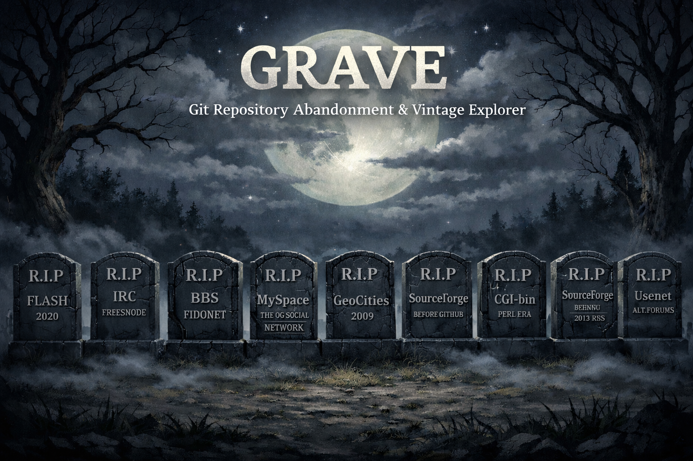
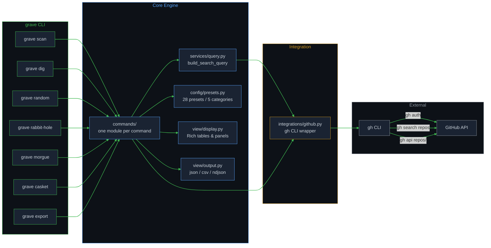
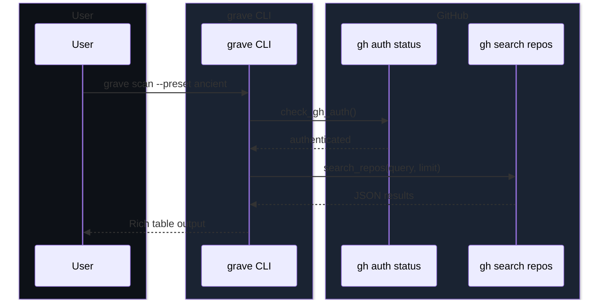

<p align="center">
  
  
  
  
  
  
  
  
</p>

<p align="center">
  
</p>

<h1 align="center">GRAVE</h1>
<h3 align="center">Git Repository Abandonment & Vintage Explorer</h3>

<p align="center">
  <em>Dig up dead, forgotten, and vintage GitHub repositories.</em>
</p>

---

**GRAVE** is a command-line tool for digital archaeology. It searches GitHub for old, weird, abandoned, and forgotten repositories using curated preset profiles and custom queries. Stateless by design — results stream to your terminal or to stdout via `export`, with no files written and no database to manage.

## Install

```bash
pipx install grave-cli
```

Or with pip:

```bash
pip install grave-cli
```

> **Requires:** Python 3.13+ and [gh CLI](https://cli.github.com) (handles all GitHub authentication)

## Quick Start

```bash
# First-time setup (checks prerequisites)
grave init

# Start digging
grave scan --preset ancient
grave random
grave dig torvalds/linux --open
```

## Features

- **28 curated presets** across 5 categories (archaeology, dead languages, eras, culture, science)
- **Era-based search** with named time windows (Y2K, dotcom bubble, Web 2.0, early GitHub)
- **Smart abandonment filters** (`--abandoned`, `--dead-since`)
- **Discovery commands** like `grave random` (slot machine) and `grave rabbit-hole` (find similar repos)
- **Thematic exploration** with `grave morgue` (dead forks) and `grave casket` (archived repos)
- **Rich terminal UI** with clickable hyperlinks, colored tables, and formatted panels
- **Export** to JSON, CSV, or NDJSON — live search results streamed to stdout
- **Stateless** — no database, no `~/.local/share/grave`, nothing written to disk
- **Zero token management** — delegates all auth to `gh` CLI

## Commands

### Core Commands

| Command | Description |
|---|---|
| `grave init` | First-time setup and prerequisite checks |
| `grave scan` | Search for repos with presets or custom parameters |
| `grave dig <owner/repo>` | Deep-dive into a specific repository |
| `grave presets` | List all 28 available search presets |

### Discovery Commands

| Command | Description |
|---|---|
| `grave random` | Random preset slot machine — surprise yourself |
| `grave rabbit-hole <owner/repo>` | Find similar repos by language, era, and topics |
| `grave morgue` | Search for dead forks and repos with inactive owners |
| `grave casket` | Find archived, unmaintained, and frozen repositories |

### Export

| Command | Description |
|---|---|
| `grave export` | Run a live search and emit results as JSON, CSV, or NDJSON to stdout |

## Usage Examples

```bash
# Preset search
grave scan --preset ancient
grave scan --preset dead-lang-cobol --limit 50
grave scan --preset flash-rip

# Era-based search
grave scan --era y2k --keyword web
grave scan --era dotcom --language Java

# Find abandoned repos
grave scan --keyword python --abandoned 10
grave scan --dead-since 2015 --language Ruby

# Custom search
grave scan --keyword "neural network" --created "2008-01-01..2012-12-31"
grave scan --keyword fractal --stars ">50" --language Python

# Deep dive
grave dig torvalds/linux
grave dig microsoft/MS-DOS --open  # opens in browser
grave dig rails/rails --json

# Discovery
grave random
grave rabbit-hole torvalds/linux
grave morgue --limit 50
grave casket --language Python

# Export (live search → stdout)
grave export --preset ancient --format json
grave export --keyword python --language Python --format csv > python.csv
grave export --preset flash-rip --format ndjson > flash.ndjson

# Filter presets by category
grave presets --category dead-languages
grave presets --category archaeology
```

## Presets

28 curated presets across 5 categories:

### Archaeology
| Preset | Description |
|---|---|
| `ancient` | GitHub's earliest repos (2008-2010) |
| `forgotten` | Old repos with few stars, untouched for 5+ years |
| `graveyard` | Archived and deprecated projects |
| `one-commit` | Repos with minimal activity, frozen in time |
| `abandoned-10y` | Repos untouched for 10+ years |
| `dotfiles-ancient` | The earliest dotfiles and system configs |

### Dead Languages
| Preset | Description |
|---|---|
| `dead-lang` | Fortran projects |
| `dead-lang-perl` | Perl relics from the CGI era |
| `dead-lang-pascal` | Pascal and Delphi survivors |
| `dead-lang-cobol` | COBOL: the language that won't die |
| `dead-lang-tcl` | Tcl/Tk scripts from a bygone era |
| `dead-lang-smalltalk` | Smalltalk: OOP's grandparent |
| `flash-rip` | Flash/ActionScript projects (RIP 2020) |

### Eras
| Preset | Description |
|---|---|
| `y2k-web` | Y2K-era web tools and relics |
| `pre-npm` | JavaScript before npm (2008-2011) |
| `pre-docker` | Infrastructure before containers |
| `pre-git` | CVS/SVN migration tools and relics |
| `homebrew-fossils` | Early macOS/Homebrew era tools |

### Culture
| Preset | Description |
|---|---|
| `digital-utopia` | Digital democracy and virtual world experiments |
| `cyber-relics` | Early internet culture and cyberspace projects |
| `irc-era` | IRC bots, clients, and scripts |
| `myspace-era` | Social network widgets and MySpace-era tools |
| `sourceforge-refugees` | Projects migrated from SourceForge |
| `bbs-era` | Bulletin board systems and BBS door games |
| `crypto-og` | Early blockchain and cryptocurrency (2009-2013) |

### Science
| Preset | Description |
|---|---|
| `weird-science` | Experimental science and simulation projects |
| `academic` | Thesis projects and academic research code |
| `dead-ai-pre2012` | Pre-AlexNet AI, abandoned by the deep-learning boom |

## Architecture


```mermaid
graph LR
    subgraph CLI["grave CLI"]
        SCAN[grave scan]
        DIG[grave dig]
        RANDOM[grave random]
        RABBIT[grave rabbit-hole]
        MORGUE[grave morgue]
        CASKET[grave casket]
        EXPORT[grave export]
    end

    subgraph Engine["Core Engine"]
        COMMANDS[commands/<br/>one module per command]
        SERVICES[services/query.py<br/>build_search_query]
        PRESETS[config/presets.py<br/>28 presets / 5 categories]
        DISPLAY[view/display.py<br/>Rich tables & panels]
        OUTPUT[view/output.py<br/>json / csv / ndjson]
    end

    subgraph Integration["Integration"]
        GITHUB[integrations/github.py<br/>gh CLI wrapper]
    end

    subgraph External["External"]
        GH[gh CLI]
        GHAPI[GitHub API]
    end

    SCAN --> COMMANDS
    DIG --> COMMANDS
    RANDOM --> COMMANDS
    RABBIT --> COMMANDS
    MORGUE --> COMMANDS
    CASKET --> COMMANDS
    EXPORT --> COMMANDS

    COMMANDS --> SERVICES
    COMMANDS --> PRESETS
    COMMANDS --> DISPLAY
    COMMANDS --> OUTPUT
    SERVICES --> GITHUB
    COMMANDS --> GITHUB

    GITHUB --> GH
    GH -->|gh auth| GHAPI
    GH -->|gh search repos| GHAPI
    GH -->|gh api repos/| GHAPI

    style CLI fill:#0d1117,stroke:#3fb950,color:#3fb950
    style Engine fill:#0d1117,stroke:#58a6ff,color:#58a6ff
    style Integration fill:#0d1117,stroke:#d29922,color:#d29922
    style External fill:#0d1117,stroke:#8b949e,color:#8b949e

    style SCAN fill:#1a2332,stroke:#3fb950,color:#c9d1d9
    style DIG fill:#1a2332,stroke:#3fb950,color:#c9d1d9
    style RANDOM fill:#1a2332,stroke:#3fb950,color:#c9d1d9
    style RABBIT fill:#1a2332,stroke:#3fb950,color:#c9d1d9
    style MORGUE fill:#1a2332,stroke:#3fb950,color:#c9d1d9
    style CASKET fill:#1a2332,stroke:#3fb950,color:#c9d1d9
    style EXPORT fill:#1a2332,stroke:#3fb950,color:#c9d1d9

    style COMMANDS fill:#1a2332,stroke:#58a6ff,color:#c9d1d9
    style SERVICES fill:#1a2332,stroke:#58a6ff,color:#c9d1d9
    style PRESETS fill:#1a2332,stroke:#58a6ff,color:#c9d1d9
    style DISPLAY fill:#1a2332,stroke:#58a6ff,color:#c9d1d9
    style OUTPUT fill:#1a2332,stroke:#58a6ff,color:#c9d1d9

    style GITHUB fill:#1a2332,stroke:#d29922,color:#c9d1d9

    style GH fill:#1a2332,stroke:#8b949e,color:#c9d1d9
    style GHAPI fill:#1a2332,stroke:#8b949e,color:#c9d1d9

    linkStyle default stroke:#3fb950,stroke-width:1.5px
```


```mermaid
sequenceDiagram
    box rgb(13,17,23) User
        participant User
    end
    box rgb(26,35,50) grave CLI
        participant CLI as grave CLI
    end
    box rgb(26,35,50) GitHub
        participant Auth as gh auth status
        participant Search as gh search repos
    end

    User->>CLI: grave scan --preset ancient
    CLI->>Auth: check_gh_auth()
    Auth-->>CLI: authenticated
    CLI->>Search: search_repos(query, limit)
    Search-->>CLI: JSON results
    CLI-->>User: Rich table output
```

## Contributing

```bash
# Clone the repo
git clone https://github.com/ul0gic/grave.git
cd grave

# Install dependencies
uv sync

# Run linting (21 ruff rule sets)
uv run ruff check .

# Type check
uv run mypy grave

# Run tests
uv run pytest

# Run the tool locally
uv run grave --help

# Build check (run after every change)
uv sync && uv run ruff check . && uv run mypy grave && uv run pytest && grave --help
```

### Project Structure

```
grave/
├── grave/                  # PEP 420 namespace package (no __init__.py)
│   ├── __main__.py         # python -m grave support
│   ├── errors.py           # UsageError
│   ├── cli/                # argparse setup, main entry, dispatch
│   ├── commands/           # one module per command + specs.py
│   ├── services/           # query.py — pure query construction
│   ├── integrations/       # github.py — gh CLI wrapper
│   ├── models/             # RepoItem, SearchSpec, Preset
│   ├── config/             # presets, eras, lenses
│   └── view/               # Rich display + json/csv/ndjson output
├── tests/                  # pytest suite (176 tests)
├── pyproject.toml          # Package config, dependencies, ruff + mypy config
├── uv.lock                 # Locked dependency versions
├── .python-version         # Python version for uv
├── .gitignore
└── README.md
```

### Tech Stack

| Layer | Technology | Why |
|---|---|---|
| Language | Python 3.13+ | Modern type system, I/O bound workload |
| Package Manager | uv | Fast, modern, handles Python versions |
| Build Backend | hatchling | Simple, standards-compliant |
| Terminal UI | rich | Tables, panels, clickable links, color |
| GitHub API | gh CLI (subprocess) | Handles auth, tokens, rate limits for us |
| Linter | ruff | Fast, strict (21 rule sets enabled) |
| Type checker | mypy --strict | Zero `# type: ignore`, full coverage |

## License

MIT

---

<p align="center">
<sub>Built for digital archaeologists, internet historians, and anyone who wonders what GitHub looked like in 2008.</sub>
</p>
