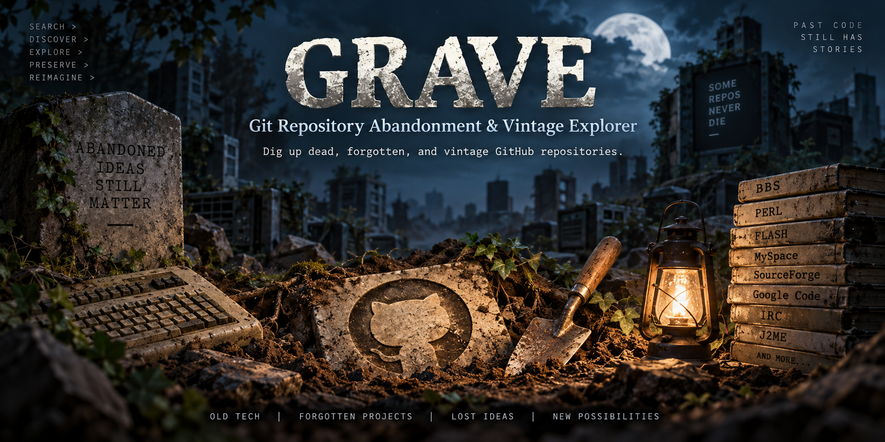

<p align="center">
  
  
  
  
  
  
  
  
</p>

<p align="center">
  
</p>

<h1 align="center">GRAVE</h1>
<h3 align="center">Git Repository Abandonment & Vintage Explorer</h3>

<p align="center">
  <em>Dig up dead, forgotten, and vintage GitHub repositories.</em>
</p>

---

**GRAVE** is a command-line tool for digital archaeology. It searches GitHub for old, weird, abandoned, and forgotten repositories using curated preset profiles and custom queries. Stateless by design — results stream to your terminal or to stdout via `export`, with no files written and no database to manage.

## Install

```bash
pipx install grave-cli
```

Or with pip:

```bash
pip install grave-cli
```

> **Requires:** Python 3.13+ and [gh CLI](https://cli.github.com) (handles all GitHub authentication)

## Quick Start

```bash
# First-time setup (checks prerequisites)
grave init

# Start digging
grave scan --preset ancient
grave random
grave dig torvalds/linux

# Optional: tab completion for commands, flags, and preset names
grave completion bash >> ~/.bashrc   # or: grave completion zsh >> ~/.zshrc
```

## Features

- **79 curated presets** across 9 categories (ahead of their time, archaeology, culture, dead languages, dead platforms, dead services, eras, human, science)
- **Every preset filters for abandonment** — a `pushed` cutoff is mandatory, so a preset never surfaces a repo that is still maintained
- **Interactive digging** — scan results are numbered; type a number to dig into that repo on the spot
- **Era-based search** with named time windows (Y2K, dotcom bubble, Web 2.0, early GitHub)
- **Smart abandonment filters** (`--abandoned`, `--dead-since`, `--archived`)
- **Discovery commands** like `grave random` (slot machine, narrowable with `--category ahead-of-time`) and `grave rabbit-hole` (find similar repos, steerable with `--language`, `--stars`, `--abandoned`)
- **Thematic exploration** with `grave morgue` (forks that gathered stars, then died) and `grave casket` (repos formally archived on GitHub)
- **Rich terminal UI** with clickable hyperlinks, colored tables, and formatted panels
- **Shell tab completion** for bash and zsh, generated from the live CLI so it never drifts
- **Export** to JSON, CSV, or NDJSON — live search results streamed to stdout
- **Stateless** — no database, no `~/.local/share/grave`, nothing written to disk
- **Zero token management** — delegates all auth to `gh` CLI

## Commands

| Command | Description |
|---|---|
| `grave init` | First-time setup and prerequisite checks |
| `grave scan` | Search for repos with presets or custom parameters |
| `grave dig <owner/repo>` | Deep-dive into a specific repository |
| `grave presets` | List all 79 available search presets |
| `grave random` | Random preset slot machine — optionally within one `--category` |
| `grave rabbit-hole <owner/repo>` | Find similar repos by language, era, and topics |
| `grave morgue` | Search for dead forks and repos with inactive owners |
| `grave casket` | Find archived, unmaintained, and frozen repositories |
| `grave export` | Run a live search and emit JSON, CSV, or NDJSON to stdout |
| `grave completion <shell>` | Print a bash or zsh tab-completion script |

## Usage Examples

```bash
# Preset search
grave scan --preset ancient
grave scan --preset proto-smartwatch          # smartwatches years before Apple's
grave scan --preset uber-for-x                # startup pitches frozen mid-pivot
grave scan --preset dead-lang-cobol --limit 50

# Era-based search
grave scan --era y2k --keyword web
grave scan --era dotcom --language Java

# Find abandoned repos
grave scan --keyword python --abandoned 10
grave scan --dead-since 2015 --language Ruby
grave scan --keyword "home automation" --archived true

# Custom search
grave scan --keyword "neural network" --created "2008-01-01..2012-12-31"
grave scan --keyword fractal --stars ">50" --language Python

# Deep dive
grave dig torvalds/linux
grave dig rails/rails --json

# Discovery
grave random
grave random --category ahead-of-time
grave rabbit-hole torvalds/linux
grave rabbit-hole rails/rails --language Ruby --abandoned 8
grave morgue --limit 50
grave casket --language Python

# Export (live search → stdout)
grave export --preset ancient --format json
grave export --keyword python --language Python --format csv > python.csv
grave export --preset flash-rip --format ndjson > flash.ndjson

# Filter presets by category
grave presets --category ahead-of-time
grave presets --category human
```

## Presets

79 curated presets across 9 categories. Every preset carries an abandonment cutoff, so results are always repos nobody has pushed to in years.

### Archaeology
| Preset | Description |
|---|---|
| `ancient` | GitHub's earliest repos (2008-2010), long since abandoned |
| `forgotten` | Old repos with few stars, untouched for a decade |
| `graveyard` | Projects their owners formally archived |
| `one-commit` | Repos with minimal activity, frozen in time |
| `abandoned-10y` | Repos untouched for 10+ years |
| `dotfiles-ancient` | The earliest dotfiles and system configs |
| `tiny-gems` | Starred repos under 10 KB: whole ideas that fit on one screen |

### Dead Languages
| Preset | Description |
|---|---|
| `dead-lang` | Fortran: still computing, rarely committed |
| `dead-lang-perl` | Perl relics from the CGI era |
| `dead-lang-pascal` | Pascal and Delphi survivors |
| `dead-lang-cobol` | COBOL: the language that won't die |
| `dead-lang-tcl` | Tcl/Tk scripts from a bygone era |
| `dead-lang-smalltalk` | Smalltalk: OOP's grandparent |
| `flash-rip` | Flash/ActionScript projects (RIP 2020) |
| `dead-lang-coffeescript` | CoffeeScript: the dialect ES6 made obsolete |

### Eras
| Preset | Description |
|---|---|
| `y2k-web` | Y2K-era web tools and relics |
| `pre-npm` | JavaScript before npm existed (2008-2011) |
| `pre-docker` | Infrastructure before containers (Puppet/Chef/Vagrant) |
| `pre-git` | CVS/SVN migration tools and pre-git relics |
| `dead-frameworks` | The 2010-2014 frontend graveyard (Backbone, AngularJS 1.x) |
| `j2me-era` | Pre-smartphone mobile: J2ME, Symbian, WAP |
| `homebrew-fossils` | Early macOS/Homebrew era tools |

### Culture
| Preset | Description |
|---|---|
| `digital-utopia` | Digital democracy and virtual world experiments |
| `cyber-relics` | Early internet culture and cyberspace projects |
| `irc-era` | IRC bots, clients, and scripts |
| `myspace-era` | Social network widgets and MySpace-era tools |
| `sourceforge-refugees` | Projects migrated from SourceForge |
| `google-code-refugees` | Projects exiled by the Google Code shutdown |
| `dead-social` | Clients and bots for social networks that no longer exist |
| `bbs-era` | Bulletin board systems and BBS door games |
| `crypto-og` | Early blockchain and cryptocurrency (2009-2013) |
| `esolangs` | Esoteric languages: Brainfuck, Befunge, Malbolge and stranger |
| `demoscene` | Size-coded intros and tracker players from the demoscene |

### Science
| Preset | Description |
|---|---|
| `weird-science` | Experimental science and simulation projects |
| `academic` | Thesis projects and academic research code |
| `dead-ai-pre2012` | Pre-AlexNet AI, abandoned by the deep-learning boom |

### Ahead of Their Time
The heart of grave. These are ideas people built before the hardware, the market, or the APIs were ready: smartwatches years before Apple's, home assistants before Alexa, self-driving cars in someone's garage. Most stalled because the tech was not there yet. It is now. Dig here when you want an old idea to rethink with modern capabilities.

| Preset | Description |
|---|---|
| `proto-smartwatch` | Smartwatches built years before Apple's |
| `vr-before-oculus` | Virtual reality before the Oculus Kickstarter |
| `ar-before-arkit` | Augmented reality on phones that could barely run it |
| `voice-before-alexa` | Voice assistants before Alexa and Siri got good |
| `chatbots-before-llm` | Chatbots from the AIML era, before language models |
| `smart-home-early` | Home automation before HomeKit and Nest |
| `self-driving-hobby` | Hobbyist self-driving cars before the industry caught up |
| `diy-drones` | Garage-built quadcopters before DJI made them a product |
| `brain-interface` | Brain-computer interfaces on consumer EEG headsets |
| `gesture-control` | Gesture and hand tracking from the Kinect hacking wave |
| `wearables-early` | Wearables and e-textiles before the category existed |
| `decentralized-social` | Federated and P2P social networks a decade before Mastodon |
| `mesh-networks` | Community mesh networks and darknets |
| `3d-printing-early` | RepRap-era 3D printing tooling |
| `iot-before-iot` | Connected sensors before anyone said Internet of Things |
| `realtime-collab` | Realtime collaborative editing before it was table stakes |
| `semantic-web` | The semantic web: RDF, ontologies, linked data |
| `quantified-self` | Lifelogging and self-tracking before fitness trackers |
| `e-paper` | E-ink hacks and e-paper displays |
| `kickstarter-corpses` | Crowdfunded projects whose code outlived the campaign |

### Dead Platforms
| Preset | Description |
|---|---|
| `windows-phone` | Windows Phone, Silverlight, and XNA apps |
| `blackberry` | BlackBerry and BB10 apps |
| `palm-webos` | Palm Pre and TouchPad webOS apps |
| `google-glass` | Glassware from the Google Glass Explorer year |
| `firefox-os` | Firefox OS and Boot2Gecko apps |
| `chrome-apps` | Packaged Chrome Apps, retired in 2020 |
| `kinect-hacks` | The 2010-2014 Kinect hacking scene |

### Dead Services
| Preset | Description |
|---|---|
| `google-reader` | Clients and clones built for Google Reader |
| `google-wave` | Gadgets and robots for Google Wave |
| `parse-refugees` | Apps built on the Parse.com backend |
| `checkin-wars` | Foursquare and Gowalla check-in apps |
| `yahoo-graveyard` | Yahoo Pipes, Delicious, and YQL mashups |
| `app-net` | Clients for App.net, the paid Twitter alternative |
| `flash-games` | Browser games from the Flash era |

### Human
The stories behind the repos: first commits, New Year's resolutions, hackathon weekends, startup pitches.

| Preset | Description |
|---|---|
| `hello-world-graveyard` | Zero-star hello-worlds from 2008-2010 whose authors never came back |
| `my-first-repo` | Someone's very first repository, abandoned after the first push |
| `learning-x` | 'Learning Rust/Haskell/Clojure/Go' repos that stopped after a month |
| `resolution-2013` | Started in the first week of 2013, dead by spring |
| `hackathon-corpses` | Built in a weekend, never touched again |
| `bootcamp-projects` | Coding bootcamp final projects and capstones |
| `uber-for-x` | 'The Uber for X' startup pitches, frozen mid-pivot |
| `todo-app-graveyard` | The universal starter project, ten thousand times over |
| `rewrite-stalled` | Rewrites in Rust or Go that stalled partway |

## Contributing

```bash
git clone https://github.com/ul0gic/grave.git
cd grave

uv sync                                                          # install dependencies
uv sync && uv run ruff check . && uv run mypy grave && uv run pytest && uv run grave --help   # full build check
```

## License

MIT

---

<p align="center">
<sub>Built for digital archaeologists, internet historians, and anyone who wonders what GitHub looked like in 2008.</sub>
</p>
